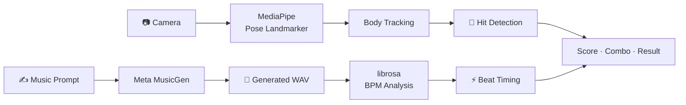

<div align="center">

# RHYTHM VISION

### Move your body. Catch the beat.

カメラの前で動くだけ。<br>
AIが生み出すビートと、あなたの身体がコントローラーになるリズムゲーム。

<br>

[](https://vuejs.org/)
[](https://vite.dev/)
[](https://ai.google.dev/edge/mediapipe/)
[](https://fastapi.tiangolo.com/)
[](https://www.docker.com/)

**Pose Tracking** · **AI Music Generation** · **Beat Synchronization**

</div>

---

## About

**RHYTHM VISION** は、Webカメラとリアルタイム姿勢推定を組み合わせた、
ハンズフリーのリズムゲームです。

MediaPipe Pose Landmarkerがプレイヤーの動きを追跡し、画面に現れるターゲットとの
接触をリアルタイムに判定。さらにMeta MusicGenでBGMを生成し、解析したBPMに
合わせてターゲットの出現タイミングを変化させます。

キーボードもゲームパッドも必要ありません。必要なのは、ブラウザとあなたの身体だけです。

## Highlights

| | Feature | Description |
|:---:|---|---|
| 🕺 | **Body as a Controller** | カメラ映像から姿勢を推定し、身体の動きをそのままゲーム入力に変換 |
| 🎵 | **Generative Soundtrack** | テキストプロンプトからMusicGenが最大30秒のオリジナルBGMを生成 |
| ⚡ | **Beat-Synced Gameplay** | 生成した音源のBPMを解析し、ビートに同期してターゲットを出現 |
| 🎯 | **Dynamic Difficulty** | 3段階のレベルで、ターゲット数・サイズ・出現間隔が変化 |
| 🔥 | **Score & Combo** | ヒット精度、コンボ倍率、最大コンボをリアルタイムに記録 |
| 🏆 | **Personal Records** | ハイスコアとプレイ統計をブラウザに保存 |

## How It Works



1. ブラウザでカメラへのアクセスを許可
2. 好きな音楽のイメージを入力してBGMを生成
3. 解析されたBPMと難易度をもとにゲームを開始
4. 身体をターゲットに重ね、スコアとコンボを伸ばす
5. リザルトで記録を確認し、次のハイスコアへ挑戦

## Quick Start

### Docker + NVIDIA GPU

> [!IMPORTANT]
> Docker構成はLinuxのhost networkとNVIDIA GPUを使用します。
> Docker、Docker Compose、NVIDIA Container Toolkitが必要です。

```bash
# モデルキャッシュを初回だけ作成
docker volume create rhythm-game_huggingface_cache

# フロントエンドとAPIを起動
docker compose up --build --force-recreate -d

# 起動状態を確認
docker compose ps
curl http://127.0.0.1:5173/api/healthz
```

ブラウザで **http://localhost:5173** を開けばプレイできます。

初回起動時はMusicGenモデルをダウンロードするため、APIの準備に数分かかります。
モデルは `rhythm-game_huggingface_cache` volumeに保存され、次回以降も再利用されます。

### Local Development

**Frontend**

```bash
npm ci
npm run dev
```

**Backend**

```bash
cd backend

python3 -m pip install \
  torch==2.5.1 torchvision==0.20.1 torchaudio==2.5.1 \
  --index-url https://download.pytorch.org/whl/cu121

python3 -m pip install -r requirements.txt
python3 main.py
```

Viteは `/api` へのリクエストをデフォルトで `http://127.0.0.1:8000` に転送します。
接続先を変更する場合は `API_PROXY_TARGET` を指定してください。

```bash
API_PROXY_TARGET=http://192.0.2.10:8000 npm run dev
```

## Architecture

```text
Browser
├── Vue 3 / Vite
├── Camera capture
├── MediaPipe pose estimation
└── Canvas game rendering
         │
         │  /api
         ▼
FastAPI
├── MusicGen inference
├── WAV generation / streaming
└── librosa BPM analysis
```

| Layer | Technology | Role |
|---|---|---|
| UI / Game | Vue 3, Canvas API | ゲーム状態、描画、スコア、リザルト |
| Vision | MediaPipe Tasks Vision | Webカメラ映像から姿勢ランドマークを検出 |
| Dev Server | Vite | フロント開発サーバーとAPIプロキシ |
| API | FastAPI, Uvicorn | BGM生成、音声配信、ヘルスチェック |
| AI / Audio | MusicGen, PyTorch, librosa | 音楽生成とBPM解析 |
| Runtime | Docker Compose, NVIDIA CUDA | GPU対応の実行環境 |

## Game System

- **判定** — ターゲットへの接近距離と反応時間からヒット精度を評価
- **コンボ** — 連続ヒットで上昇し、10コンボごとに倍率が `0.5` ずつ増加
- **難易度** — Level 1〜3でターゲット数、半径、出現テンポが変化
- **ビート同期** — BPMとレベルからターゲットの出現間隔を動的に計算
- **記録** — 上位10件のハイスコアと累計統計を `localStorage` に保存

## Project Structure

```text
rhythm-game/
├── src/
│   ├── App.vue              # ゲームロジック、UI、Canvas描画
│   └── main.js              # Vueエントリーポイント
├── backend/
│   ├── main.py              # MusicGen API、BPM解析、音声配信
│   ├── requirements.txt     # Python依存関係
│   └── Dockerfile           # CUDA対応バックエンド
├── public/                  # 静的アセット
├── Dockerfile               # フロントエンド
├── docker-compose.yml       # GPU対応サービス構成
└── vite.config.js           # Vite / APIプロキシ設定
```

## Remote Access

リモートのLinuxマシンで動かし、Macなどからアクセスする場合は、
ViteのAPIプロキシを利用できるよう5173番ポートだけをSSH転送します。

```bash
ssh -N -L 5173:127.0.0.1:5173 <user>@<remote-host>
```

その後、ローカルブラウザで **http://localhost:5173** を開いてください。

## Notes

- プレイにはWebカメラとブラウザのカメラアクセス許可が必要です。
- カメラAPIの制約により、リモートアクセス時は `localhost` またはHTTPSを使用してください。
- MusicGenの推論はGPUを強く推奨します。CPUでも実行できますが、生成に時間がかかります。
- Dockerで `network_mode: host` を使用するため、`docker compose ps` の `PORTS` 欄が空でも正常です。
- APIヘルスチェック: **http://localhost:5173/api/healthz**

---

<div align="center">

**Turn up the volume. Step into the frame. Hit the beat.**

</div>
